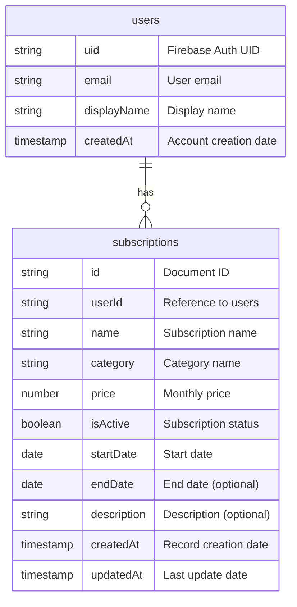

# SubTrack データベース設計

## ER図

## コレクション詳細

### users コレクション

ユーザー情報を管理するコレクションです。Firebase Authenticationと連携しています。

| フィールド | 型 | 説明 | 必須 |
|------------|------|-------------|--------|
| uid | string | Firebase Authentication のUID | ✅ |
| email | string | ユーザーのメールアドレス | ✅ |
| displayName | string | 表示名 | ✅ |
| createdAt | timestamp | アカウント作成日時 | ✅ |

### subscriptions コレクション

サブスクリプションサービスの情報を管理するコレクションです。

| フィールド | 型 | 説明 | 必須 |
|------------|------|-------------|--------|
| id | string | ドキュメントID（自動生成） | ✅ |
| userId | string | ユーザーID（usersコレクションへの参照） | ✅ |
| name | string | サブスクリプション名 | ✅ |
| category | string | カテゴリ名（例：ストリーミング、学習など） | ✅ |
| price | number | 月額料金 | ✅ |
| isActive | boolean | アクティブ状態 | ✅ |
| startDate | date | 開始日 | ✅ |
| endDate | date | 終了日 | - |
| description | string | 説明文 | - |
| createdAt | timestamp | レコード作成日時 | ✅ |
| updatedAt | timestamp | 最終更新日時 | ✅ |

## インデックス

### subscriptions コレクション

1. 月別集計用インデックス
   - フィールド: userId, isActive, startDate
   - 用途: ユーザーごとの月別支出集計

2. カテゴリ別集計用インデックス
   - フィールド: userId, category, isActive
   - 用途: ユーザーごとのカテゴリ別支出集計

## セキュリティルール

1. ユーザーは自分のデータのみ読み書き可能
2. 認証済みユーザーのみがデータにアクセス可能
3. 各フィールドの型チェックを実施

## データの整合性

1. サブスクリプションの作成時に必須フィールドをチェック
2. 価格は0以上の数値のみ許可
3. startDateはendDateより前の日付である必要がある
4. isActiveの更新時にendDateを自動設定

## 分析データの生成

Analysis Pageでは以下のデータを動的に生成します：

1. 月別支出推移
   - 過去6ヶ月分のデータを表示
   - アクティブなサブスクリプションの月額料金を集計

2. カテゴリ別支出
   - 現在アクティブなサブスクリプションをカテゴリごとに集計
   - 金額の大きい順にソート 