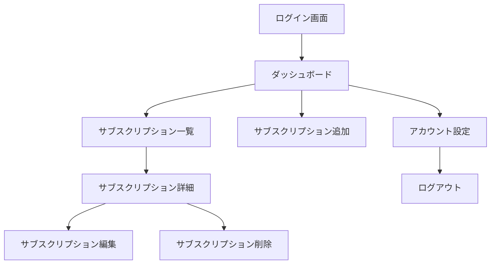

# 📄 サブスクリプション管理アプリ 要件定義書（v1.0）

## 1. プロジェクト概要
- **目的**：ユーザーが契約中のサブスクリプションサービスを一元管理し、無駄な支出を可視化・削減するためのWebアプリケーションを提供する。
- **対象ユーザー**：複数のサブスクリプションを契約している個人ユーザーや、フリーランスの支出管理ニーズを持つ人。
- **開発者**：個人開発（ユーザー自身）

## 2. 対応プラットフォーム
- ✅ Webアプリケーション（モバイル対応）
- ⬜ PWA対応（可能であれば実施）
- ⬜ デスクトップアプリ（Electronなど、将来的に対応を検討）
- ⬜ モバイルアプリ（React NativeやExpoでの展開も視野に）

## 3. 技術スタック（確定＋検討）
| 項目 | 内容 |
|------|------|
| **フロントエンド** | Next.js（TypeScript, App Router予定） |
| **UIライブラリ** | Tailwind CSS |
| **バックエンド** | Firebase（Firestore + Firebase Auth） |
| **認証** | 必要（GoogleログインやEmail/Passwordログインなど） |
| **通知機能** | 現時点ではなし |
| **支払方法の管理** | 不要（支払い手段は入力項目から除外） |

## 4. バックエンド構成（Firebase）
- **Firestore** によるデータ保存（NoSQL）
- **Firebase Authentication** によるログイン管理（Google、Email/Password）
- **Firebase Hosting** による本番公開も検討可能

## 5. 機能一覧（MVP）

| 機能名 | 説明 | 実装予定 |
|--------|------|----------|
| サブスクリプション登録・編集 | サービス名、金額、支払サイクル、支払日、カテゴリ、メモなどを記録 | ✅ |
| サブスク一覧表示 | 一覧で契約内容と支払い金額を確認できる | ✅ |
| 合計金額表示 | 月額・年額の合計を自動計算 | ✅ |
| 契約状態の記録 | 解約済み・契約中のステータス管理 | ✅ |
| フィルタ・並び替え | 金額順、支払日順、カテゴリ別など | ✅ |
| ダッシュボード | サマリー表示（今月の支払額など） | ✅ |
| ログイン機能 | 認証付きでデータを個人にひも付け | ✅ |
| データ保存 | Firebase Firestoreを利用 | ✅ |
| 履歴機能 | （あれば便利だが、MVPでは未実装可） | ⬜ |
| CSVエクスポート | ⬜（拡張機能として検討） |

## 6. 画面構成

### 1. ログイン画面

**目的**: ユーザー認証を行う

**要素**:

- メールアドレス入力フィールド
- パスワード入力フィールド
- ログインボタン
- 新規登録リンク
- パスワードリセットリンク

### 2. ダッシュボード

**目的**: ユーザーのサブスクリプション概要を表示

**要素**:

- 月額合計表示
- 次回支払予定一覧
- サブスクリプション追加ボタン
- ナビゲーションメニュー

### 3. サブスクリプション一覧

**目的**: 登録済みサブスクリプションの一覧表示

**要素**:

- サブスクリプション名
- 料金
- 支払サイクル
- 次回支払日
- 詳細表示リンク

### 4. サブスクリプション追加

**目的**: 新しいサブスクリプションの登録

**要素**:

- サブスクリプション名入力フィールド
- 料金入力フィールド
- 支払サイクル選択（例: 月額、年額）
- 次回支払日入力フィールド
- 保存ボタン

### 5. サブスクリプション詳細

**目的**: 特定のサブスクリプションの詳細情報を表示

**要素**:

- サブスクリプション名
- 料金
- 支払サイクル
- 次回支払日
- 編集ボタン
- 削除ボタン

### 6. サブスクリプション編集

**目的**: 既存のサブスクリプション情報の更新

**要素**:

- サブスクリプション名入力フィールド（既存値表示）
- 料金入力フィールド（既存値表示）
- 支払サイクル選択（既存値表示）
- 次回支払日入力フィールド（既存値表示）
- 保存ボタン

### 7. サブスクリプション削除

**目的**: サブスクリプションの削除確認と実行

**要素**:

- 削除確認メッセージ
- 削除実行ボタン
- キャンセルボタン

### 8. アカウント設定

**目的**: ユーザーアカウントの管理

**要素**:

- メールアドレス表示
- パスワード変更リンク
- ログアウトボタン

## 画面遷移図



## 7. データ構造（例）

```ts
interface Subscription {
  id: string;
  name: string;
  category: '動画' | '音楽' | '仕事' | 'その他';
  billingCycle: 'monthly' | 'yearly';
  amount: number;
  nextPaymentDate: string; // ISO 8601形式
  status: 'active' | 'cancelled';
  notes?: string;
  userId: string; // 認証ユーザーに紐づく
}
```

## 8. 非機能要件
- レスポンシブ対応（スマホ・タブレット最適化）
- セキュアな認証（JWT/Token管理）
- サーバー側・クライアント側のバリデーション
- 認証ベースのデータ隔離（他ユーザーのデータは見られない）
- ログインなしでの利用は不可（最低でも匿名認証）

## 9. 開発スケジュール（案）

| フェーズ | 内容 | 期間（目安） |
|---------|------|-------------|
| 要件定義・技術選定 | 要件固め、技術候補選定 | ✅ 完了 |
| UI設計・モックアップ | ワイヤーフレーム or デザイン作成 | 〜1日程度 |
| 実装フェーズ | フロント＋バックエンド開発 | 1〜2週間（MVP） |
| テスト & 調整 | 動作確認・リファクタ | 2〜3日 |
| 公開（MVP） | Vercelなどにデプロイ | 随時 |

